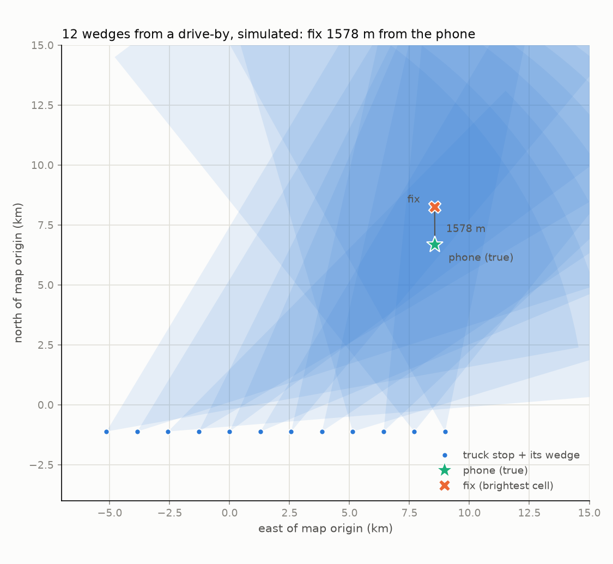

# BearingFix RF

A low-cost, passive RF locator for search and rescue — built in public by, not a self-taught dev, but a self-learning dev.

## About

I drive a truck for a living and work on this about five hours a week. I'm teaching myself RF and signal processing from the ground up. The code is written with Claude; I'm learning to understand it well enough to explain the concepts, and the devlog records what I understand, what I don't yet, and what changed. Personal learning project: not taking PRs or issues for now, but read, run, and learn from it. If you really feel you have something to add or personal advice, please connect with me on LinkedIn or DM me on X.

## What it is

A receive-only direction finder that listens for what a phone already transmits (cellular pings, BLE beacons) and estimates a bearing. Transmits nothing, needs no license. Built from an SDR, a switched 4-element antenna array, and a Raspberry Pi for well under $1,000. Commercial airborne phone-locating systems work well but cost far more than a volunteer team can spend; this is an attempt at the affordable version.

## What it's not

SAR teams have advanced systems that force a phone to ping by acting as a
proxy cell tower. If there's no tower, there's no ping, and these systems
solve that by bringing the tower with them. They excel in remote wilderness
and other true dead zones. BearingFix does not compete with them.

Those systems cost tens or hundreds of thousands of dollars, so they are
mostly owned by state and federal entities. Local teams have nothing.

Where BearingFix fits is in areas with enough coverage that a phone can
find a signal and is doing what it's programmed to do: trying to connect.
That covers tower-rich environments, and more to the point, tower-sparse
environments that still have *some* signal. The goal is a package that a
county or volunteer team can squeeze into its budget.

## Status

Simulator built and tested, no hardware in hand yet. Range, accuracy, and whether BLE is detectable from altitude are open questions; the devlog will report what I measure, including the disappointing results. The wedge-map display is a design goal, not a shipped feature.

## Try it

No hardware needed. [explore_sim.py](explore_sim.py) puts one imaginary phone at a bearing you choose and narrates every stage of the pipeline as it finds it — raw I/Q, the switching tone, the phase at each antenna, the bearing, fusion, the map. Five knobs at the top, three seconds to run:

```
git clone https://github.com/ScottSagerDev1/bearingfix-rf
cd bearingfix-rf
pip install -e .
python explore_sim.py
```

What each stage means and what to try: [docs/explore_sim.md](docs/explore_sim.md).
Would rather read than install? A full example run: [docs/explore_sim_sample_output.txt](docs/explore_sim_sample_output.txt).



The script's last stage, drawn: each stop lays a wedge along its measured bearing, and where twelve of them pile up is the fix (`tools/plot_wedges.py`).

## Technical details

See [docs/technical.md](docs/technical.md).

## License and trademark

Source-available for noncommercial use (personal projects, education, research) under the [PolyForm Noncommercial License](LICENSE) — not open source in the community-contribution sense; see [TRADEMARKS.md](TRADEMARKS.md) for name usage.
