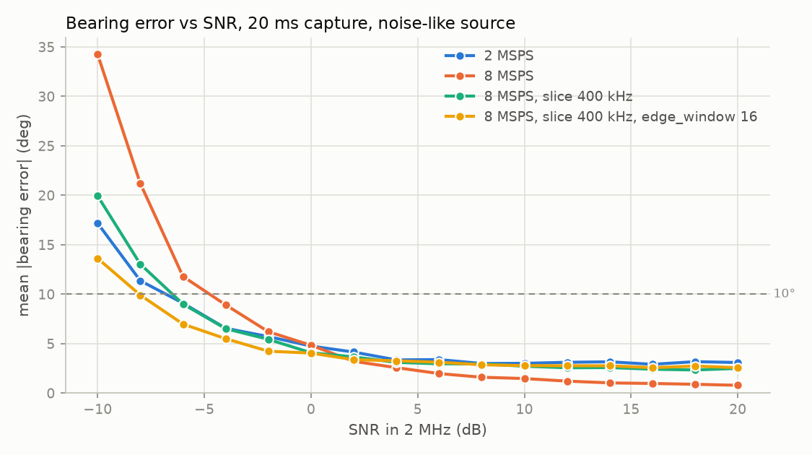
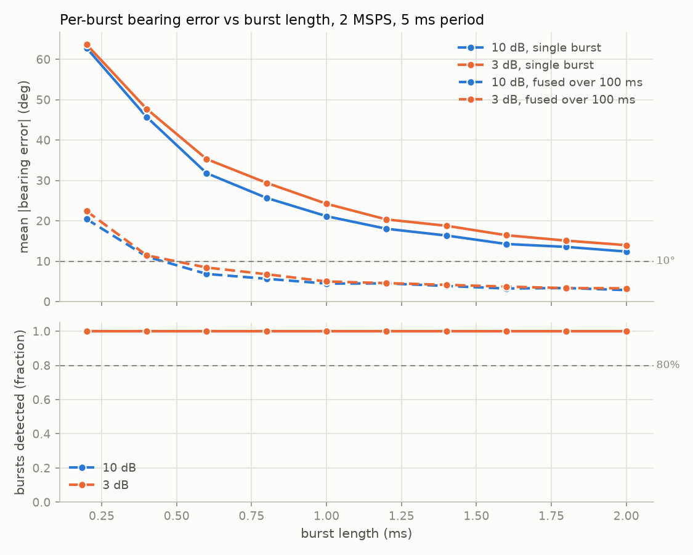
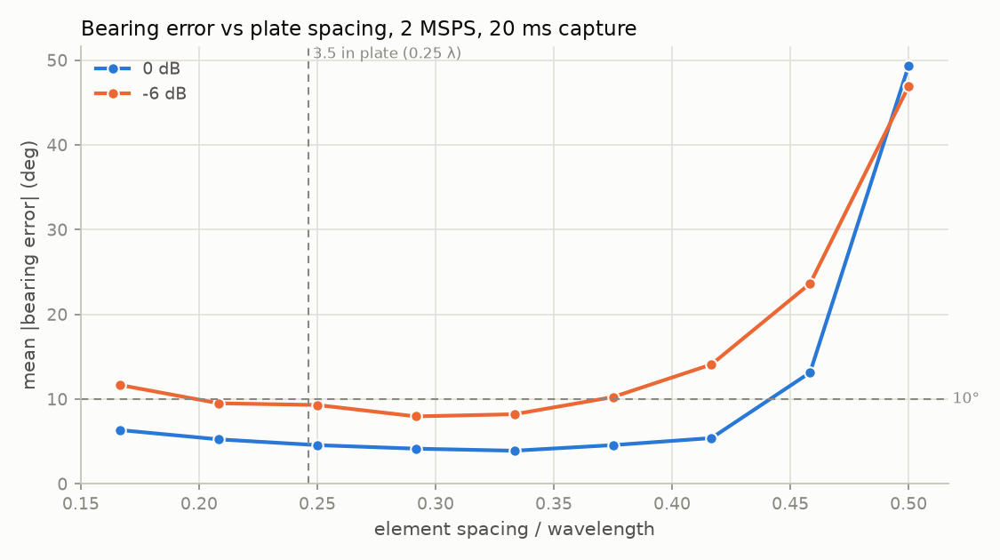

# Parameter sweeps: where the pipeline breaks, and why

Generated 2026-09-17 with `python tools/sweep.py` (50 trials × 8 bearings per
point, ~14 min on 16 cores). Exact numbers are in [results.md](results.md);
re-running the tool regenerates that file and the PNGs but not this page, so
if the numbers below disagree with results.md, results.md is newer.

Everything here is simulation. The source is the noise-like "LTE stand-in"
(180 kHz of filtered noise), not a clean tone, because that is what a phone
looks like. Switch timing is assumed known, as it is after a one-time
calibration. No multipath, no mutual coupling between elements, no analog
anti-alias filter — so this says what the *DSP* can do, not what the radio
will do.

"Error" throughout is the mean absolute bearing error in degrees, wrapped so
that 359° vs 1° counts as 2°, not 358°.

## The short version

| Question | Answer |
|---|---|
| SNR floor for ≤ 10° error, 2 MSPS | **−6 dB** in 2 MHz |
| SNR floor for ≤ 10° error, 8 MSPS (pipeline defaults) | **−4 dB** — worse |
| SNR floor for ≤ 10° error, 8 MSPS (slice and edge window held in physical units) | **−8 dB** — best |
| Shortest burst that gives ≤ 10° on its own | **none** (2 ms burst is still 12°) |
| Shortest burst that gives ≤ 10° once 100 ms of them are fused | **0.6 ms** |
| Where wider plate spacing stops helping | **about λ/4 to λ/3**; catastrophic from ~0.45 λ |
| Which sample rate to default to | **Don't switch yet.** 8 MSPS wins only if two other defaults change with it. See the last section. |

## 1. SNR

**What the axis means.** "SNR in 2 MHz" is the phone's power relative to the
noise in a 2 MHz-wide window. That is the number you would read off a
spectrum display at 2 MSPS. At 8 MSPS the capture window is 4× wider and
holds 4× the noise, so the *same transmitter* reads 6 dB lower in the raw
8 MSPS SNR. The sweep corrects for that; every curve on this plot is the same
phone at the same distance.

**Result.** At 2 MSPS the pipeline holds under 10° down to −6 dB — the phone
can be *weaker than the noise* in a 2 MHz window and still give a usable
bearing. Below that it falls apart fast: 11° at −8 dB, 17° at −10 dB (and
the 90th percentile at −10 dB is 39°, i.e. one estimate in ten is junk).

**Why it fails at low SNR — the discriminator threshold.** The bearing lives
in the size of the phase *step* at each switch instant. The FM discriminator
measures phase step between neighbouring samples. Phase is only meaningful
when the signal vector is bigger than the noise vector added to it; once
noise is comparable to signal, the measured phase is as likely to be noise's
direction as the signal's, and it wraps around ±180° at random. Averaging
over hundreds of edges pulls the estimate back toward the truth, but the
error grows much faster than 1/SNR once you cross that threshold. This is
the same "threshold effect" that makes FM radio go from clean to static in a
short distance. Look up: *FM threshold effect*, *click noise*.

**Why there is a floor at high SNR.** Above about +4 dB the 2 MSPS curve
stops improving at ~3°, no matter how strong the signal. That is not thermal
noise — it is the source's *own* phase. A 180 kHz-wide noise-like signal
changes its phase on a timescale of roughly 1/180 kHz ≈ 5 µs. The estimator
averages 4 samples before and 4 after each edge; at 2 MSPS that is 2 µs on
each side, and in those 2 µs the source has drifted by itself. The phase
step we measure is "array step + source drift", and the source drift never
averages out because it is the same sign on both sides of any one edge. A
clean tone has no such drift, which is why the tone tests reach 1–2°. Look
up: *coherence time*, *self-noise*.

## 2. Burst length

Solid lines are the error of each burst on its own; dashed lines are the
error after fusing all ~20 bursts in one 100 ms capture (circular mean).

**Result.** A single 1 ms burst — one LTE subframe — gives ±21° at 10 dB.
Even a 2 ms burst is still 12°. The 10° target is never met per burst. But
fuse the bursts in 100 ms of capture and it is ≤ 10° from **0.6 ms**
upward, and ~4.5° at 1 ms. SNR barely matters here (the 3 dB and 10 dB
curves are almost on top of each other), which is a clue.

**Why short bursts fail — not enough edges.** Every switch edge is one noisy
measurement of the bearing. At f_rot = 8 kHz the array makes 4 edges per
rotation, so 32 edges per millisecond. A 0.2 ms burst holds ~6 edges, minus
the ones thrown away by the 30 µs guard at each end and the detector's
uncertainty about where the burst really started — you are left with a
handful of noisy phase steps, and the answer is nearly random (63°; a
completely random guess scores 90°). The error falls roughly as
1/√(number of edges): doubling the burst cuts error by about 30%, not by
half. That is the same square-root law that governs averaging anything
noisy. Look up: *standard error*, *1/√N*.

**Why SNR barely helps here.** Same reason as the high-SNR floor above: the
per-edge error at these SNRs is dominated by the source's own phase wander
inside the 2 µs edge window, not by thermal noise. More transmitter power
does not make the source drift less. That is why the fix for bursts is *more
edges* (longer bursts, or more bursts fused), not more gain.

**Why fusing works.** Twenty bursts × 21° per burst → 21/√20 ≈ 4.7°, and
the measured fused error at 1 ms is 4.5°. The tracker in `tracker.py` is
doing exactly this job on real captures. It also means the number that
matters in the field is *how many subframes per second the phone sends*, not
how long each one is.

**Detection.** The energy detector found 100% of bursts at every length,
including 0.2 ms, because its 150 µs smoothing and 250 µs gap-closing
stretch short bursts past the 250 µs minimum. Detection is not the limit;
information per burst is.

## 3. Plate spacing

**Result.** At 0 dB, error improves from 6.3° at λ/6 to 3.9° at λ/3, then
turns around: 5.4° at 0.42 λ, 13° at 0.46 λ, and 49° at λ/2 — the estimate
is useless there. The 3.5 in plate sits at 0.25 λ at 830 MHz, which is
within 1° of the best. At −6 dB the whole curve lifts and the breakdown
starts earlier (0.42 λ instead of 0.46 λ).

**Why bigger is better, up to a point.** The bearing signal is the phase
*difference* between neighbouring elements, and that difference is set by
how far apart they are in wavelengths. For this square the largest possible
adjacent-element step is 2π·(spacing/λ). Double the spacing, double the step,
and the same noise is now a smaller fraction of it — the estimator's "gain"
goes up. This is why tiny arrays are unambiguous but insensitive.

**Why it breaks near λ/2 — phase wraps.** A phase measurement can only tell
you the step modulo 360°: a step of +190° looks exactly like −170°. When the
spacing reaches λ/2, the largest legitimate step reaches ±180°, and any
noise at all pushes some steps across the line where they wrap to the
opposite sign. One wrapped edge points 180° the wrong way, and a few of them
in the average wreck it. The breakdown begins before λ/2 because noise
spreads the measured step around its true value; lower SNR → wider spread →
earlier breakdown, exactly as the −6 dB curve shows. Look up: *phase
ambiguity*, *spatial aliasing*.

**What it means for the plate.** Spacing stops paying somewhere between λ/4
and λ/3. Going from 3.5 in to ~4.7 in (λ/3 at 830 MHz) would buy well under
1° at 0 dB while moving the 850 MHz end of the band to 0.34 λ, closer to the
cliff — and the sim does not model multipath, which punishes wider spacing
in the real world. 3.5 in stays.

## 4. Sample rate — should the default move to 8 MSPS?

Read the SNR plot again with the three 8 MSPS curves in mind:

- **8 MSPS, pipeline defaults** (orange): *worse* than 2 MSPS below 0 dB
  (34° vs 17° at −10 dB; floor −4 dB vs −6 dB) but *better* above 0 dB
  (0.8° vs 3.1° at 20 dB).
- **8 MSPS, slice held at 400 kHz** (green): tracks 2 MSPS almost exactly.
- **8 MSPS, slice 400 kHz and edge window 16 samples** (yellow): best of
  all — floor −8 dB, and never worse than 2 MSPS.

**Why the defaults hurt at low SNR.** `DFConfig.slice_bw` defaults to
0.2 × fs. At 8 MSPS that is a 1.6 MHz slice instead of 400 kHz — 4× the
noise bandwidth feeding the discriminator, for a source that is only 180 kHz
wide. That drags the threshold up by roughly 6 dB, and the curve shows about
that. Holding the slice at 400 kHz (green) removes the penalty.

**Why the defaults help at high SNR.** `DFConfig.edge_window` is 4
*samples*. At 8 MSPS that is 0.5 µs each side of the edge instead of 2 µs,
so the source's own phase drift inside the window is a quarter of what it
was, and the high-SNR floor drops from 3° to under 1°. That is the cleanest
demonstration in this whole sweep that the high-SNR floor is self-noise, not
thermal noise.

**Why the fourth curve wins.** Make both parameters physical: keep the
slice at 400 kHz and stretch the window back to ~2 µs (16 samples at 8 MSPS)
so 4× as many samples are averaged over the same time span. Now noise
bandwidth matches 2 MSPS and the extra samples are pure gain. The remaining
difference (−8 vs −6 dB floor) is small and consistent with the edges
landing on exact sample boundaries at 8 MSPS (dwell 250) instead of half
way between them at 2 MSPS (dwell 62.5).

**The sim cannot answer the hardware half.** GSG's reason to run ≥ 8 MSPS
is analog: the ADC is not specified below 8 MHz and the narrowest baseband
filter (1.75 MHz) cannot stop energy 1–2 MHz off-carrier from aliasing into a
2 MSPS capture. None of that is modelled here. Checklist step 10 is the
real-world A/B.

**Recommendation: don't change the default yet.** 8 MSPS is clearly better
*if* the two sample-count parameters are re-expressed in physical units at
the same time; with today's defaults it is a wash that trades low-SNR reach
for high-SNR precision. If you decide to switch, everything that would need
to move together:

- `DFConfig` (`dsp.py`): `fs = 8e6`; `slice_bw` default from `0.2 * fs` to a
  fixed ~400 kHz (or a bandwidth-based rule capped well below fs);
  `edge_window` from 4 samples to a duration (~2 µs) converted to samples.
- `SimConfig.fs` (`sim.py`) and `HackRFSettings.fs` (`hackrf_io.py`) to 8e6.
- CLI (`cli.py`): `--fs` default and the usage examples in the docstring.
- Tests: all 37 are tuned at 2 MSPS — `2e6` appears as a literal in the
  timing-recovery, tracker and PRACH tests; `PRACHDetector` and
  `generate_prach` build sequences from fs; every tolerance would need
  re-checking at 8 MSPS. `test_sweep.py` is rate-agnostic.
- Docs: `technical.md` simulation numbers; checklist step 6 (dwell 250,
  `--frot 8000` — which is actually tidier than 62.5 / 8064.5).
- Cost: 4× the bytes (16 MB per second of capture) and ~4× the CPU
  (83 ms vs 22 ms per 20 ms capture on this machine). On a Raspberry Pi
  that is the difference between keeping up and not, so measure it there
  before committing.
